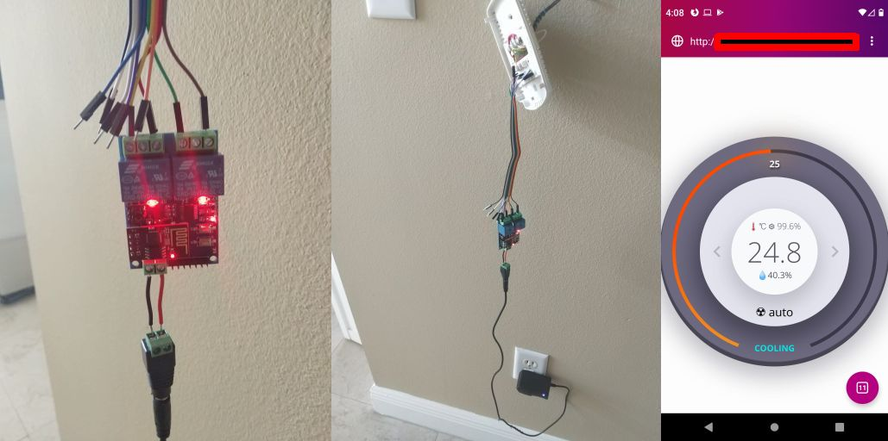
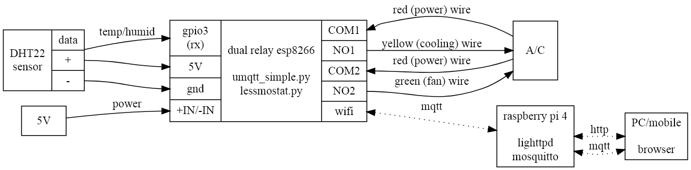
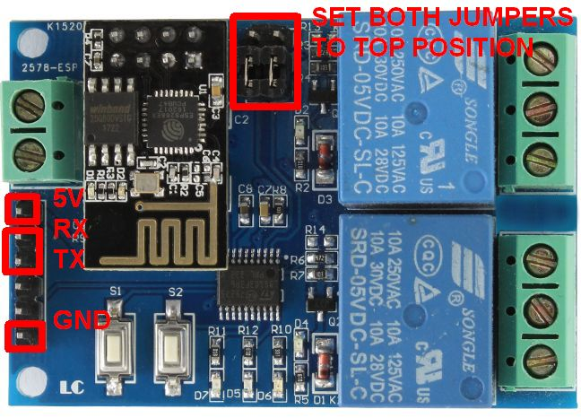
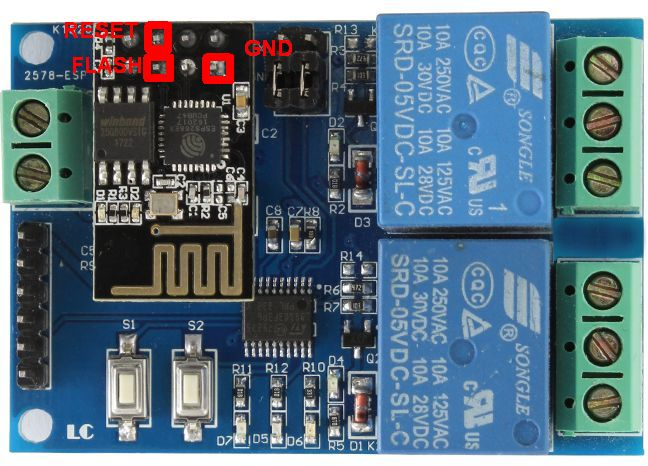
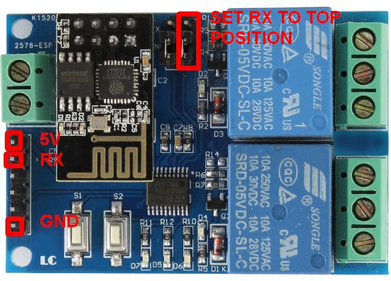
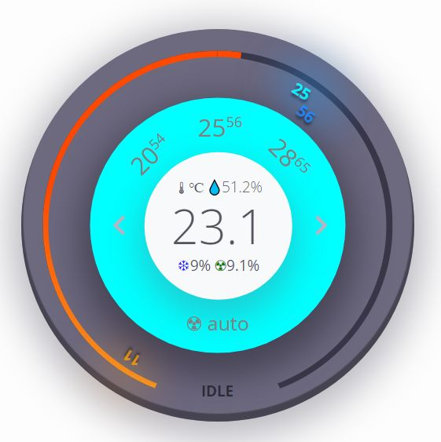
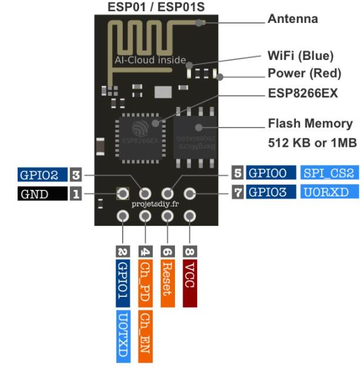
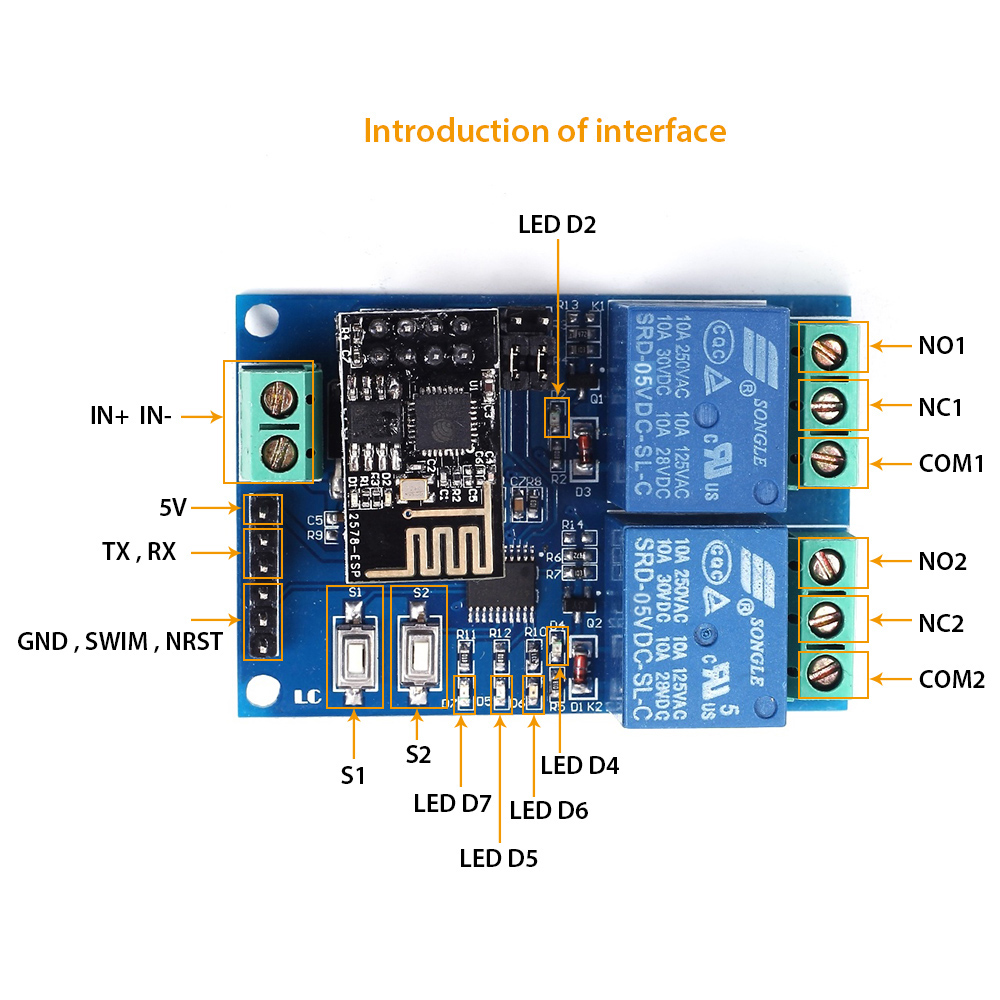
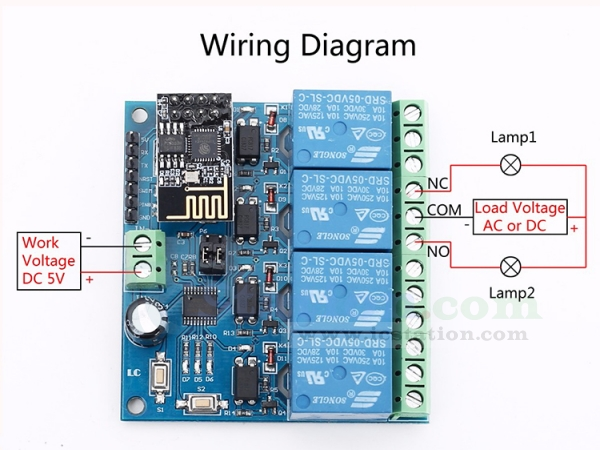

# Lessmostat "less is more" esp8266 wifi smart AC thermostat


*dangling prototype and web app*


## Introduction
This is a 
- solder-less: no wires to solder, all wires screwed
- resistor-less: no need to add resistors anywhere
- c-wire less: thermostat is powered by an external 5V power supply, no need for a [C wire](https://www.honeywellhome.com/us/en/support/everything-you-need-to-know-about-a-c-wire/) coming from the AC, and only red, yelllow (cooling mode) or white (heating mode) and green wires are used.
- costless: less than $25
- wireless /thermostat: Based on micropython and esp8266 WIFI chip, humidity/temperature programmable via WIFI, with humidity/temperature presets and fan and ac utilization display.


## TODOs
- alexa integration with fauxmo/fauxhue
- complex hourly/daily/weekly/dusk/dawn scheduling
- charts statistics, integration with influxdb/grafana
- deep sleep/batteries
- security, MQTT SSL
- cloud instead of Raspberry Pi (eg AWS MQTT)
- on device http server

## Block Diagram



For heating mode, connect the white (heating) wire instead of the yellow (cooling) wire or, on a 4-relay system, connect the white (heating) wire to NO3 and red (power) wire to COM3
## Hardware

- $14.69 [ESP8266 Dual Channel WiFi Relay Board On-board ESP-01 Smart Home Phone APP Remote Switch Module 5940mm](https://www.amazon.com/dp/B07MNLJW1P)  
    - You will need the 4 relay version if you want AC **and** heater control [ESP8266 ESP-01 4 Channel 5V WiFi Relay Module 5V IOT Wireless Smart Home Device WiFi Relay Internet of Things ESP-01 Module Board for Phone APP Remote Control](https://www.amazon.com/dp/B0BG2G4F3V) (another option is use the dual channel relay and lose independent fan control, so the fan is connected to both cooling and heating and only enabled when cooling or heating is on).
- $14.37/2 [Gowoops 2pcs DHT22 / AM2302 Digital Humidity and Temperature Sensor Module for Arduino Raspberry Pi, Temp Humidity Gauge Monitor Electronic Practice DIY Replace SHT11 SHT15](https://www.amazon.com/dp/B073F472JL)
    - Don't use [Tangyy DHT22 Digital Temperature and Humidity Sensor Replace SHT11 SHT15 Measure Module for Raspberry Pi](https://www.amazon.com/dp/B08QHW9TS8), never got any reads, always timed out
    - Can use the cheaper DHT11 if you are fine with single degree Celsius precision (tested from a different kit I had)
- $6.96/10 [GOSONO 10Pcs/lot Male DC Power Plug Connector 2.5mm x 5.5mm/2.1x5.5 (Screw Fastening Type) Needn't Welding DC Plug Adapter (Green 5 Male + 5 Female 2.5x5.5mm, Green)](https://www.amazon.com/dp/B07V4F9NDK) 
    - Alternatively cut the barrel plug off from the power supply
- $8.99/2 [2 Pack, JOVNO 5V 1A Power Supply DC 5V 1000mA 5W Power Adapter Cord 100-240V AC to DC 5 V 0.8A 0.5A 450mA Converter Transformer 5.5x2.5mm Tip for WS2812B WS2811 LED Pixels WiFi Camera Wireless Router](https://www.amazon.com/dp/B0915SC87J)
- 18 AWG wire for 24V connections between A/C red,green and yellow wires and esp8266 relays
    - Alternatively plug the A/C wires directly to the relays, although your A/C will probably only have one red wire and you will need a short wire to connect the relay COMs
- male-male jumper wire for 5V connections between esp8266 and power supply (unless you cut off the power supply barrel plug)
- $6.99 [JBtek Windows 8 Supported Debug Cable for Raspberry Pi USB Programming USB to TTL Serial Cable](https://www.amazon.com/gp/product/B00QT7LQ88) 
    - Or (simpler and no need to manually short contacts) [Stemedu USB to ESP8266 ESP-01 Serial Wireless Transceiver 4MB SPI Flash WiFi Module ESP-01S Prog WiFi Programmer Downloader CH340C Chip with Reset Button](https://www.amazon.com/dp/B08QMMGZLB) $10.99 (tested)

Plus a Raspberry Pi or any machine that can host a web page and an MQTT broker.

## Software

### esp8266 dual relay board
- 1MB micropython firmware
- [umqtt_simple](https://github.com/micropython/micropython-lib/blob/master/micropython/umqtt.simple/umqtt/simple.py)
- lessmostat.py

### Raspberry Pi 
(any Webserver/MQTT broker)
- Thermostat web page based on https://codepen.io/simoberny/pen/wrGoZZ and related css and fonts included in the external directory
  - Copyright (c) 2021 by Simone Bernabè (https://codepen.io/simoberny/pen/wrGoZZ)
- Paho MQTT javascript library from https://cdnjs.cloudflare.com/ajax/libs/paho-mqtt/1.1.0/paho-mqtt.js included in the external directory.
- jquery from https://cdnjs.cloudflare.com/ajax/libs/jquery/3.2.1/jquery.min.js included in the external directory
- mosquitto MQTT broker
- lighttpd (any webserver)

## Setup

### Raspberry Pi
(or any machine with a MQTT broker and a webserver)

- install mosquitto, optionally install the clients to do command-line tests
```bash
sudo apt-get install mosquitto
sudo apt-get install mosquitto-clients
```
- Set configuration /etc/mosquitto/mosquitto.cfg to enable web sockets, optionally move log away from sdcard
```bash
# log_dest file /var/log/mosquitto/mosquitto.log
log_dest file /mnt/usb0/mosquitto/mosquitto.log

include_dir /etc/mosquitto/conf.d

# this will listen for mqtt on tcp
listener 1883

# this will listen for websockets on 9001
listener 9001
protocol websockets
```
- Restart mosquitto with
```bash
sudo systemctl restart mosquitto
```
- Install lighttpd or any webserver
- Copy the files from the [html](html) directory onto the webserver
    - If the webserver has a different ip from the MQTT broker, modify the line
      in lessmostat.html 
      ```javascript
      var host = location.hostname;
      ```
      with the IP address or hostname of the MQTT broker machine, eg
      ```javascript
      var host = "192.168.8.200";
      ```


### esp8266 dual relay board
- Install some Python on your PC
- Install esptool.py Python tool on your PC
```bash
pip install esptool
```
- NOTE: the serial TTL method of flashing firmware below requires briefly shorting contacts, alternatively remove the esp8266 from the board and use [Stemedu USB to ESP8266 ESP-01 Serial Wireless Transceiver 4MB SPI Flash WiFi Module ESP-01S Prog WiFi Programmer Downloader CH340C Chip with Reset Button](https://www.amazon.com/dp/B08QMMGZLB) if you are not comfortable with that.
- Move the esp8266 board's rx and tx jumpers to the "top" position, this will break the connection between the esp8266 and the STM8S103, chip preventing interferences when using serial to access esp8266. Connect USB TTL to:
    - red: 5v
    - green: rx
    - white: tx
    - black: gnd
    - There's no need to connect the power supply at this point, the USB port will supply power through the 5V/GND pins.

    
- Once connected to USB and powered, reset the chip into flash mode, for that short the reset and flash to ground and then let the reset go (so it stops continuously resetting) but keep flash to ground (so the last reset leaves the chip in flash mode).

    
- At this point you should be able to see the chip using esptool.py
```bash
esptool.py flash_id

esptool.py v3.1
Found 1 serial ports
Serial port COM4
Connecting....
Detecting chip type... ESP8266
Chip is ESP8266EX
Features: WiFi
Crystal is 26MHz
MAC: xx:xx:xx:xx:xx:xx
Uploading stub...
Running stub...
Stub running...
Manufacturer: 68
Device: 4014
Detected flash size: 1MB
Hard resetting via RTS pin...
```
- Backup existing firmware with esptool.py
```bash
esptool.py --baud 460800 read_flash 0x00000 0x100000 flash_1M.bin
```
- Download a 1MB [Micropython esp8266 firmware](https://micropython.org/download/esp8266/). 
    - [esp8266-1m-20210902-v1.17.bin](https://micropython.org/resources/firmware/esp8266-1m-20210902-v1.17.bin) is known to work.
- Erase flash and flash micropython, note
    - the esp-01 chip only has 1MB of memory, needs a 1MB micropython image. If you use eg a 2MB image, the flash will succeed, but you will find that many operations (webrepl setup, etc) fail with ENODEV because there's no space for storing files in the filesystem.
    - the esp-01 chip in this module needs the **flash_mode=dout** setting or it will fail to boot once flashed (but it can still be put into flash mode and reflashed).
```bash
esptool.py erase_flash
esptool.py --baud 460800 write_flash --flash_mode=dout --flash_size=detect 0 esp8266-1m-20210902-v1.17.bin
```
- On the PC, start a serial terminal program (eg Putty) and connect to the esp8266 with 115200, 8 bits, no parity, 1 stop bit
    - You should see the REPL prompt ">>>" if you press enter or when booting with the serial cable connected.
- On the serial terminal, disable wifi access point mode
```python
import network
ap_if = network.WLAN(network.AP_IF)
ap_if.active(False)
```
- On the serial terminal, enable WIFI station mode and connect to your WIFI router
```python
sta_if = network.WLAN(network.STA_IF)
sta_if.active(True)
sta_if.scan()
sta_if.connect('<your ESSID>', '<your password>')
```
- On the serial terminal, enable webrepl
```python
import webrepl_setup
```
- At this point you can stop using the serial terminal and disconnect the USB, the rest will be done via webrepl. On the PC, connect to webrepl pointing the browser to http://micropython.org/webrepl
- Move board's jumper tx back to bridge tx1 so the esp8266 can send the relay commands to the STM8S103 (rx will be used for DHT sensor later so it needs to stay without bridging to rx1)
- Connect DHT 
    - 5V
    - gnd
    - data to rx
    - rx to rx1 jumper in top position (rx not bridged to rx1)
    
    
- Connect A/C to relays
    - red (24V) to COM1 and COM2 (common relays 1 and 2)
    - yellow (cooling) to NO1 (normally open relay 1)
    - green (fan) to NO2 (normally open relay 2)
- Connect the 5V power supply male barrel connector to the female, connect the female breakout to the esp8266 board in+ and in- screws using jumper cables.
- Send files from the [upython](upython) directory to esp8266 with webrepl
    - change the mqtt_broker entry in lessmostat.cfg with the address of your MQTT machine
    - Note once you push main.py and reboot, you will be unable to send commands via UART anymore since main.py is called on every boot and the UART rx pin is stolen by lessmostat.py (you will get serial echo from the esp8266 since tx still works, but not serial input into esp8266). If you need to re-enable UART access, just delete main.py from webrepl with <code>import os; os.remove("main.py")</code>
- Now you should be able to test that esp8266 MQTT commands are being received on the MQTT broker machine, eg:
    - on the MQTT broker machine, start a subscriber to any messages coming from lessmostat
    ```bash
    mosquitto_sub -t apartment/lessmostat/# -v
    ```
    - the console should now show the sensor information messages coming from esp8266 every few seconds:
    ```bash
    apartment/lessmostat/info/sensor {"humid": 48.9, "temp": 26.0, "ts": 1633966444}
    apartment/lessmostat/info/sensor {"humid": 48.8, "temp": 26.0, "ts": 1633966455}
    ...
    ```
    - you can also publish a state request command on another console
    ```bash
    mosquitto_pub -t apartment/lessmostat/control/state -m "{ \"cmd\" : 12 }"
    ```
    - and the subscriber console should show the message from the esp8266
    ```bash
    apartment/lessmostat/info/state {"state": {"config": {"ac_rules": [{"state": "on", "temp": 20.5}], "mqtt_broker": "192.168.8.200", "fan_rules": [{"state": "auto"}], "lo_threshold_decidegs": 4, "hi_threshold_decidegs": 4, "mode": "heating", "presets": [{"fan": {"state": "auto"}, "ac": {"state": "on", "temp": 22}}, {"fan": {"state": "auto"}, "ac": {"state": "on", "temp": 25}}, {"fan": {"state": "auto"}, "ac": {"state": "on", "temp": 28}}]}, "fan_mod_ts": 1643823728, "ac": "off", "ac_mod_ts": 1643823728, "ac_uptime": 0, "fan": "off", "start_ts": 1643823728, "fan_uptime": 0, "sensor": {"humid": 55.9, "temp": 22.1}}, "ts": 1643824271}
    ```
- Access http://webserverip:port/lessmostat.html from any browser and operate the lessmostat!



## Development Notes

### esp-01 information 



https://www.utmel.com/components/esp-01-wi-fi-module-esp-01-pinout-programming-and-esp-01-vs-esp8266-faq?id=990

### esp8266 dual channel WIFI relay board




The specific esp8266 chip used in the board is an esp-01s (in some places it's also detected as esp8265).

The esp-01 has too few GPIOs to operate all the necessary components in the board (switches, LEDs, relays). To solve that, the dual channel wifi relay board relay has an intermediary chip STM8S103 that the esp8266 communicates with via UART (when the TX to TX1 and RX to RX1 jumpers are set), and the STM8S103 is the one in charge of operating the relays and LEDs (it's unknown if any of the switches or the LEDS are directly accessible from the esp-01, or if they are not, the STM8S103 commands necessary to operate them).


In the two normal modes of operation, the default firmware listens at TCP port 8080 for magic hex numbers and redirects them to the STM8S103, then that chip enables/disables the relays depending on the hex numbers provided:

```python
relay_1_off = [0xA0, 0x01, 0x00, 0xA1]
relay_1_on = [0xA0, 0x01, 0x1, 0xA2]
relay_2_off = [0xA0, 0x02, 0x00, 0xA2]
relay_2_on = [0xA0, 0x02, 0x01, 0xA3]
```

The board can operate in two modes toggled by the S1 switch:
- Mode 1: the esp8266 acts as a station listening for the TCP commands. This requires configuring the router's SSID and password described in the [icstation website](http://www.icstation.com/esp8266-wifi-channel-relay-module-smart-home-remote-control-switch-android-phone-control-transmission-distance-100m-p-12592.html).
- Mode 2: the esp8266 acts as an access point listening for the TCP commands, also described in [icstation website](http://www.icstation.com/esp8266-wifi-channel-relay-module-smart-home-remote-control-switch-android-phone-control-transmission-distance-100m-p-12592.html).

In addition, the board can also be configured as:
- Dual USB relay: the esp8266 is removed and the PC connects to the TX, RX, 5V and GND and sends the relay control commands to the ST chip directly bypassing the esp8266.
- esp8266 development mode: the PC connects to the TX, RX, 5V and GND, disables the TX1,RX1 jumpers and talks to the esp8266. In this mode the esp8266 cannot operate the relays, since the ST chip RX and TX lines have been cutoff.

Finally, if you put the board in esp8266 development mode and short the esp-01's GPIO0 to GND when booting, you can also flash your own firmware. Flashing your own firmware frees RX gpio3 for your own purposes (or even TX if you don't care about operating the relays).

See 
- http://www.lctech-inc.com/cpzx/1/94.html
- http://www.icstation.com/esp8266-wifi-channel-relay-module-smart-home-remote-control-switch-android-phone-control-transmission-distance-100m-p-12592.html

### esp8266 quad channel WIFI relay board



The quad channel relay board works the same way as the dual channel, but the STM8S103 accepts eight commands:
```python
relay_1_off = [0xA0, 0x01, 0x00, 0xA1]
relay_1_on = [0xA0, 0x01, 0x1, 0xA2]
relay_2_off = [0xA0, 0x02, 0x00, 0xA2]
relay_2_on = [0xA0, 0x02, 0x01, 0xA3]
relay_3_off = [0xA0, 0x03, 0x00, 0xA3]
relay_3_on = [0xA0, 0x03, 0x01, 0xA4]
relay_4_off = [0xA0, 0x04, 0x00, 0xA4]
relay_4_on = [0xA0, 0x04, 0x01, 0xA5]
```

See
- http://www.lctech-inc.com/cpzx/1/48.html
- https://www.icstation.com/esp8266-wifi-channel-relay-module-remote-control-switch-wireless-transmitter-smart-home-p-13420.html


### DHT11 vs. DHT22

When the temperature is set to 77F on my old thermostat, it actually engages at 77.5F and stops at 76.5F. This is something you can do with DHT22 because it has enough precision, but DHT11 with integer Celsius precision you have to settle for engaging at 26C and stopping at 24C. 
On the flip side, DHT11 is cheaper and faster to read (1s vs. 2s).
